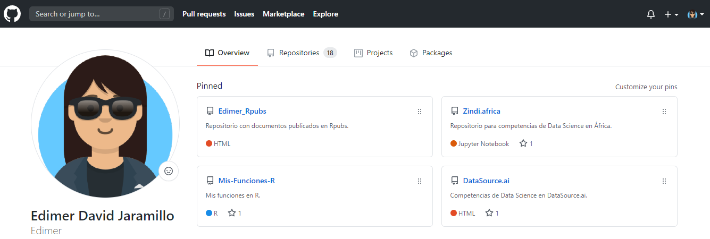

class: inverse, center, middle

# Lenguaje de programación
<html>

</html> 

---

# Concepto

.pull-left[
 

]

.pull-right[
 
- Un lenguaje de programación es un lenguaje formal, es decir, un lenguaje con reglas gramaticales bien definidas. Le proporciona a una persona (programador) la capacidad de escribir instrucciones o secuencias de órdenes en forma de algoritmos con el fin de controlar el comportamiento físico o lógico de una computadora, de manera que se puedan obtener diversas clases de datos o ejecutar determinadas tareas.
]

.footnote[
[1] [Tomado de wikipedia](https://es.wikipedia.org/wiki/Lenguaje_de_programaci%C3%B3n)
]

---
class: inverse, center, middle

# Material de apoyo
<html>

</html>

---

# Repositorio Github

 

.footnote[
[1] [Diapositivas, código fuente y datos.](https://github.com/Edimer/Unal-Palmira-Data-Science)
]

---
class: inverse, center, middle

# ¡Gracias!

<html>

</html> 

